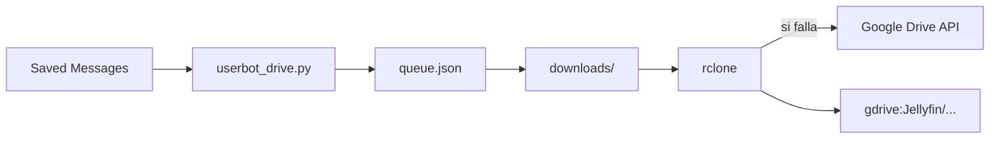

# Arquitectura — telegram-drive

Un solo proceso. No hay bot de BotFather.

## Runtime

- Cliente Pyrogram `Client("my_account", api_id, api_hash)` — sesión de usuario.
- Filtro: chat `"me"` (Mensajes Guardados). Ignora el resto.
- Cola en disco (`queue.json`) para sobrevivir un corte.
- `download_lock` (una descarga a la vez) y `upload_semaphore` (hasta 5 subidas).
- Progreso en el propio chat (`/panel`).

## Subida

1. **rclone** al remote configurado (camino feliz, reanudable, no pasa por el límite del Bot API).
2. Si rclone falla: API de Drive con `MediaFileUpload` resumable.

No hay recodificación. El nombre lo elige quien manda el archivo.

## Qué no se publica

Sesión Pyrogram, `rclone.conf`, JSON de Google, la cola con paths locales.
